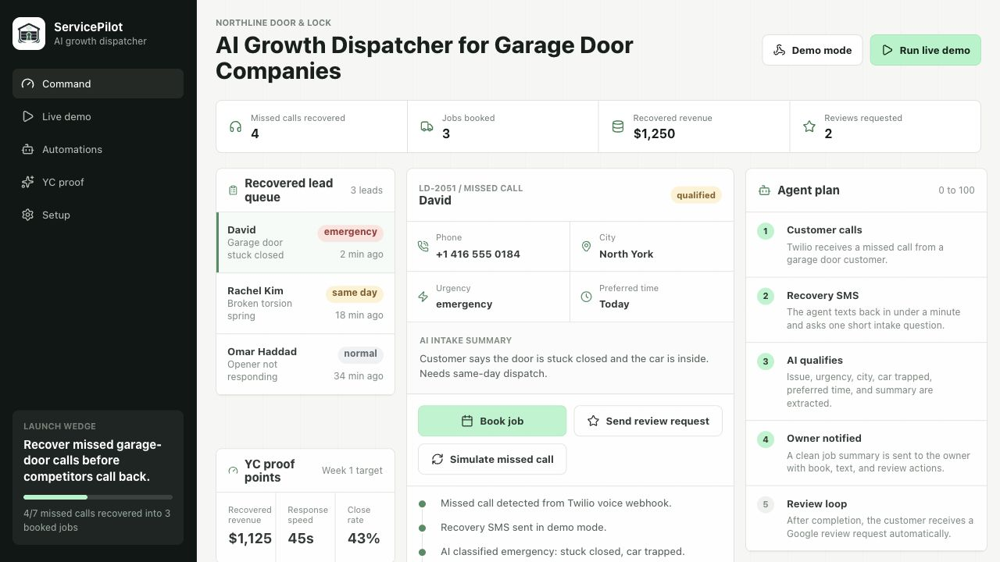
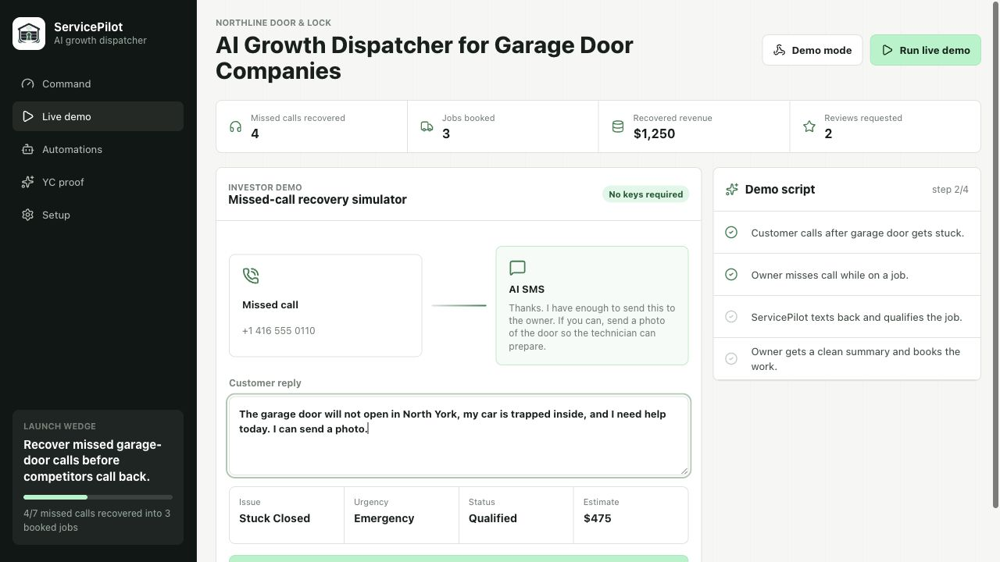

# ServicePilot

AI Growth Dispatcher for garage door and locksmith companies.

ServicePilot recovers missed calls, qualifies customers over SMS, sends clean job summaries to owners, books appointments, and follows up for Google reviews. The first wedge is garage door companies because missed emergency calls are high-intent, easy to measure, and often worth hundreds of dollars.





## Business Plan

### Problem

Small service businesses miss calls while owners and technicians are already on jobs. Those calls are usually high-intent: a garage door is stuck closed, a car is trapped, a lock needs urgent replacement, or a customer needs same-day help. If the business does not respond quickly, the customer calls the next company.

### Product

ServicePilot is an AI SMS dispatcher that sits behind a Twilio phone number.

1. Customer calls the business.
2. Twilio forwards the call to the owner.
3. If the owner does not answer, ServicePilot texts the customer in under a minute.
4. The AI intake flow collects the issue, urgency, city/address, preferred time, and photos when useful.
5. The owner gets a dispatch-ready summary.
6. The job can be booked.
7. After completion, ServicePilot sends a Google review request.

The MVP deliberately starts with SMS instead of real-time voice AI. SMS is cheaper, easier to inspect, safer for customer communication, and strong enough to prove whether missed-call recovery books jobs.

### Ideal Customer Profile

Initial ICP:
- Garage door repair companies
- 1-10 technicians
- Owner-operated or dispatcher-light
- Buying leads from Google Local Services, SEO, Yelp, or paid search
- Losing calls during field work or after hours

Expansion:
- Locksmiths
- HVAC
- Plumbing
- Appliance repair
- Other emergency home services

### Wedge

Missed-call recovery.

This is the easiest outcome to sell because the before/after metric is concrete:
- missed calls recovered
- qualified leads created
- jobs booked
- revenue recovered
- reviews requested

### MVP Scope

Included now:
- React/Vite operator dashboard
- Live missed-call recovery simulator
- Outbound lead-finder marketing agent (real OpenStreetMap data, no API keys)
- Deterministic AI intake classifier for demo mode
- Twilio Voice webhook route
- Twilio call-status recovery route
- Twilio inbound SMS route with TwiML response
- Supabase schema with RLS
- Netlify Functions API layer
- Booking endpoint
- Review request endpoint
- Metrics endpoint
- YC/demo operating model spreadsheet

Not built first:
- full CRM
- technician mobile app
- invoices/payments
- ServiceTitan or Jobber integration
- real-time voice agent
- SEO page generator

### Revenue Model

Simple first pricing:
- $299/month per location for missed-call recovery and review automation
- optional usage pass-through for Twilio SMS/calls
- later: $499-$799/month for dispatch automation, calendar sync, and CRM integrations

Why this can work:
- one recovered emergency garage door job can be worth $300-$800
- a few recovered calls can cover monthly pricing
- review requests compound local search conversion

### Go-To-Market

Week 1:
- launch demo
- onboard 1 garage door operator manually
- connect Twilio number and Supabase
- prove missed-call recovery

Week 2:
- measure response rate, qualified leads, booked jobs
- manually help dispatch if needed
- collect owner feedback

Week 3:
- add calendar booking and review loop for real pilot
- build case study around recovered revenue

Week 4:
- onboard 2-3 more companies
- track weekly recovered revenue and review lift

### YC Narrative

We are building the AI front desk for local emergency service businesses. The first product is a Twilio-powered AI SMS agent that recovers missed calls for garage door companies, qualifies urgent leads, notifies the owner, books jobs, and requests reviews.

The market is large because every service vertical has the same problem: paid leads and organic calls are wasted when no one answers. We start with garage doors because urgency and revenue are obvious, then expand across trades.

### Lead Finder (Outbound Marketing Agent)

Missed-call recovery is the inbound wedge. The Lead Finder is the outbound side: an agent that goes and finds new customers for the operator.

Open the **Lead finder** tab, type a service area (for example `North York, Toronto`), and run the agent. It:

1. Geocodes the area with OpenStreetMap Nominatim.
2. Scans OpenStreetMap Overpass for real local businesses that own serviceable doors — auto shops, dealerships, car washes, self-storage, warehouses, fire stations, and trade suppliers.
3. Scores each business for fit, estimates door count and annual account value, and drafts a ready-to-send first message.
4. Lets the operator push any prospect into the same lead queue, booking, and review loop with one click.

This uses **real, free, keyless data** (OpenStreetMap), so it works in the browser during `npm run dev` and on Netlify without configuration. The server route `/api/marketing/prospect` can additionally persist prospects to Supabase. If the live source is ever unreachable, the agent falls back to a deterministic sample set so the demo never breaks.

## Architecture

```text
Customer call / SMS
        ↓
Twilio phone number
        ↓
Netlify Functions
        ↓
AI intake classifier
        ↓
Supabase Postgres
        ↓
Owner SMS summary
        ↓
Booking + review follow-up
        ↓
Dashboard metrics
```

## Tech Stack

- Frontend: React, TypeScript, Vite
- Hosting/API: Netlify + Netlify Functions
- Database: Supabase Postgres
- Phone/SMS: Twilio
- AI: deterministic demo classifier now, OpenAI-ready via `OPENAI_API_KEY`
- Lead sourcing: OpenStreetMap (Nominatim geocoding + Overpass), free and keyless
- Workbook: Excel model for YC/demo metrics

## API Routes

| Method | Route | Purpose |
|---|---|---|
| `POST` | `/api/twilio/inbound-call` | Forward inbound calls and attach no-answer callback |
| `POST` | `/api/twilio/call-status` | Trigger missed-call recovery SMS |
| `POST` | `/api/twilio/inbound-sms` | Classify customer replies and return Twilio XML |
| `POST` | `/api/ai/intake` | Classify issue, urgency, missing fields, and reply |
| `POST` | `/api/marketing/prospect` | Find local commercial door accounts as outbound leads |
| `POST` | `/api/calendar/book` | Create a scheduled job |
| `POST` | `/api/followups/review` | Send review request SMS |
| `GET` | `/api/dashboard/metrics` | Return dashboard metrics |
| `GET/POST` | `/api/leads` | Demo/Supabase lead access |

## Local Development

```bash
npm install
npm run dev
```

Run checks:

```bash
npm run build
npm run lint
npm run typecheck:functions
```

## Environment Variables

Copy `.env.example` and set values locally or in Netlify.

Required for production:
- `SUPABASE_URL`
- `SUPABASE_SERVICE_ROLE_KEY`
- `TWILIO_ACCOUNT_SID`
- `TWILIO_AUTH_TOKEN`
- `TWILIO_MESSAGING_SERVICE_SID` or `TWILIO_FROM_NUMBER`
- `OWNER_PHONE_NUMBER`
- `FORWARD_TO_NUMBER`

Optional:
- `OPENAI_API_KEY`
- `GOOGLE_CALENDAR_ID`

Keep `SERVICEPILOT_DEMO_MODE=true` until real SMS sending is intended.

## Supabase Setup

Run the migration:

```sql
supabase/migrations/202606030001_servicepilot_mvp.sql
```

Tables:
- `companies`
- `leads`
- `messages`
- `jobs`
- `followups`
- `integration_events`

All public tables have RLS enabled. Server writes should use the Supabase service role key from Netlify Functions only. Do not expose the service role key in the browser.

## Twilio Setup

Configure the Twilio phone number:

- Voice webhook: `https://YOUR_SITE.netlify.app/api/twilio/inbound-call`
- Messaging webhook: `https://YOUR_SITE.netlify.app/api/twilio/inbound-sms`

The voice route forwards calls to `FORWARD_TO_NUMBER`. If the call is not answered, Twilio posts to `/api/twilio/call-status`, which sends the missed-call recovery SMS.

## Deployment

This repo includes `netlify.toml`.

Build command:

```bash
npm run build
```

Publish directory:

```text
dist
```

Functions directory:

```text
netlify/functions
```

## Demo Assets

The app includes:
- branded ServicePilot mark
- live missed-call simulator
- outbound lead-finder agent (real OpenStreetMap data)
- operator dashboard
- YC proof surface
- setup checklist
- GitHub-ready screenshots in `docs/screenshots/`
- YC/demo operating workbook at `docs/ServicePilot_YC_MVP_Model.xlsx`

## Current Status

This is a functional MVP prototype with production-shaped integration boundaries. It runs locally in demo mode without API keys and is ready to connect to Supabase, Twilio, and Netlify environment variables for a real pilot.
